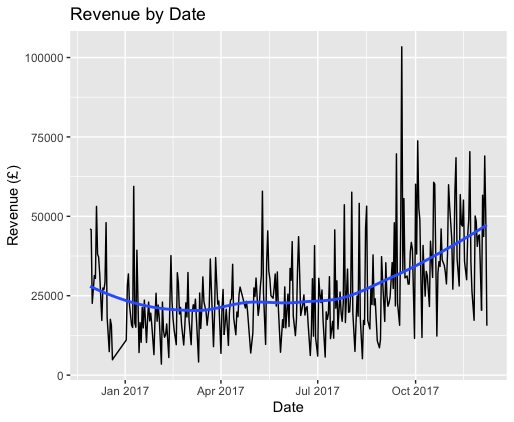

# eCommerce in R
## More inventory or customer service?
 In this project, e-commerce data on year 2016 to 2017 is analyzed for identifying most valuable customers, their regions and shopping habits. KMeans clustering is used to identify that four-cluster model is optimal on InvoiceNo, StockCode, Description, InvoiceDate, CustomerID, Country, date, month, dayOfWeek. Shopping transactions are significantly different depending on days of a week based on non-normal distributions. 
 

A heatmap on customers shopping pattern with respect to recency, orders, revenue, medianRevenue and meanRevenue provides that recency and orders provide higher contrast among customers. Most customers incur a single transaction. Revenue by customer follows a log normal distribution. 

The top five countries with most valuable customers are United Kingdom, Netherlands, EIRE, Germany and France based on revenue and number of daily transactions. The ranking holds true over time. 

Wednesday holds the highest median number of transactions and revenue during a week whereas Saturday brings the least of those two indicators. 

The month of highest revenue of the year is November, followed by October. The same pattern holds true for the number of transactions. The revenue has been increasing over time.

The average order value does not change much between different days of a week or across countries, as shown below. Missing values are dropped during the initial data procurement.

In conclusion, the best way for customer segmentation is KMeans for k=4. Other meaningful ways of grouping customers include by transaction numbers, recency and mean revenue. Clustering by days of a week and months of a year also provides relevant insights on ecommerce shopping patterns. The merchant is recommended to stock more inventories at warehouses close to UK and all countries in November, October, December and September. Goods of higher unit prices can be stocked more in Netherlands warehouses following confirmation of the average number of items purchased per order. Website data can be increased on Wednesdays and in less amount on Tuesdays. Prepare for longer customer service hours on Wednesdays. Further analysis on this topic providing similar data would feed unit price and quantity as features into KMeans study. In addition, predictive models and time series analysis can be carried out.

---

## References:

https://www.kaggle.com/chrisbow/e-commerce-eda-and-segmentation-with-r

https://www.datanovia.com/en/blog/k-means-clustering-visualization-in-r-step-by-step-guide/